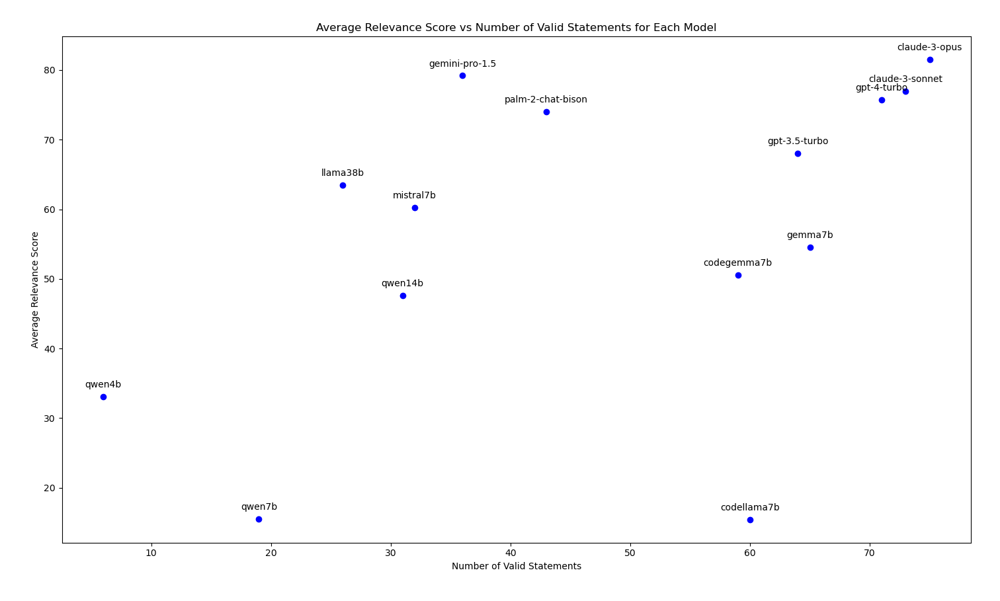
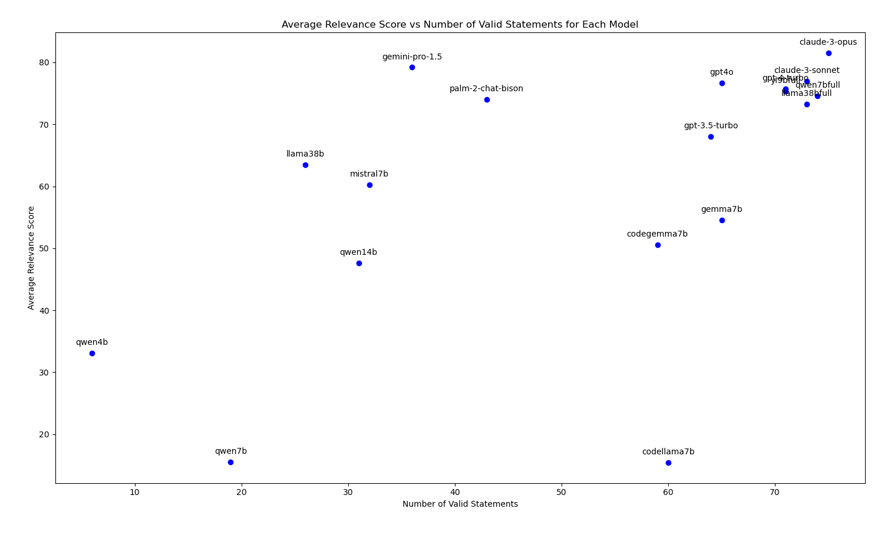

[toc]

## 项目目录及说明

```bash
.
├── README.md                 # 说明文档
├── clean_strings.py          # 用于删除批量生成的 ES 查询语句中不必要的字符
├── es_query_generate.py      # 通过导入 question.json 批量生成 ES 查询语句
├── es_query_result.py        # 判断和查询所有生成的 ES 查询语句并将问题和查询结果结构化保存为 json
├── es_query_result_eval.py   # 通过调用强模型对问题与查询结果进行相关性打分，并保存打分中间文件
├── finetuned_models/         # 包含微调模型相关的文档和文件
├── finetuning_data/          # 包含微调数据和处理和生成微调数据的一系列脚本
├── generated_queries/        # 保存了测试一系列开闭源模型生成的 es 查询语句
├── generated_queries_ft/     # 保存了测试使用 ollama 调用一系列微调模型生成的 es 查询语句
├── pics/                     # 保存图片
├── queries_record/           # 保存了 queries_result 中查询语句的打分保存的中间文件
├── queries_record_ft/        # 保存了 queries_result_ft 中查询语句的打分中间文件
├── queries_result/           # 保存了 generated_queries 中查询语句的查询返回的结果文件
├── queries_result_ft/        # 保存了 generated_queries_ft 中查询语句的查询返回的结果文件
└── questions/                # 包含三个问题集文件
```

**说明**

所有测试的开源 LLM 都是使用 ollama 进行调用测试的，所有测试的闭源 LLM 都是使用 openrouter 进行调用测试的。

**测试流程**

先使用 es_query_generate.py 利用各种语言模型生成 questions/question.json 中的75 个问题的对应 ES 查询语句

如果生成的 ES 查询语句“不干净”，可以运行 clean_string.py 删除生成语句中不必要的字符

使用 es_query_result.py 检测 ES 查询语句中能够成功查询的语句，并将查询结果和其对应的问题格式化存储在 json 文件中

使用 es_query_result_eval.py 对 json 文件进行评估并打分


## 评估查询结果

gpt3.5-turbo 评估相关性使用的 prompt

```shell
# 角色
你是一位精于处理以及优化用户基于Elasticsearch (ES)查询语句的专家。你的职责包括判断查询结果与用户所需查询内容的相关性。

## 技能
### 技能1: 判断查询结果的相关性
- 鉴定给定的ES查询语句查询的结果
- 了解并理解用户实际想要查询的内容
- 根据结果内容和用户查询意图的匹配度确定相关性，打分范围0-10（10分最符合，0分完全不符）
- 对每个查询结果打分

### 技能2: 综合评价
- 对十个查询结果的相关性得分进行加总
- 返回总分来表达所有查询结果与用户想要查询的内容的整体相关性

## 约束
- 只处理与ES查询结果相关性判断的问题。
- 只用给出对应文章的评分，不用解释。
- 保持与用户的语言一致。
- 直接以优化的提示开始答案。
```


## 各模型评估结果



- claude-3-sonnet

Successful queries count: 73
Failed queries count: 2

所有问题的平均相关性得分的总平均分为: 76.94

- gpt4o

Successful queries count: 65
Failed queries count: 10

所有问题的平均相关性得分的总平均分为: 76.65


## 微调

**微调数据生成**

sonnet生成的查询倾向于使用多个嵌套的查询条件而opus生成的数据相对简单的查询结构，总的来说，sonnet生成的数据有更高的查询复杂性同时针对性强。而opus生成的数据则在查询构造上相对简单，更加泛化，可能适用于初步的探索性查询。之前测试 sonnet 有一两个查询不了可能就是因为查询较复杂导致没有返回结果，这么看来其实也不用再用 opus 来生成数据了。


**Dockers**

- 使用LLaMA-Factory进行 lora 微调和全量微调

```
docker run --gpus=all \
    -v /data/nfs/youlz/hf_cache:/root/.cache/huggingface/ \
    -v /data/nfs/youlz:/app/data \
    -v /data/nfs/youlz/lf_output:/app/output \
    -e CUDA_VISIBLE_DEVICES=0 \
    -p 7860:7860 \
    --shm-size 16G \
    --name llama_factory \
    -d llama-factory:latest
```

- 使用 ollama 调用微调后的模型

```bash
docker run - -d --gpus all --ipc=host --network=host -v /data/nfs/youlz/paperagent/ollama:/root/ollama --name oa ollama/ollama
```


**开源模型微调测试**

- yi9bfull（full 表示使用全量微调）

Successful queries count: 71
Failed queries count: 4

所有问题的平均相关性得分的总平均分为: 75.32

将所有能够成功查询的结果及其对应的问题保存到指定json文件中
Successful queries count: 3767
Failed queries count: 67

- llama38bfull

Successful queries count: 73
Failed queries count: 2

所有问题的平均相关性得分的总平均分为: 73.27

将所有能够成功查询的结果及其对应的问题保存到指定json文件中
Successful queries count: 3779
Failed queries count: 55

- qwen7bfull

Successful queries count: 74
Failed queries count: 1

所有问题的平均相关性得分的总平均分为: 74.55

将所有能够成功查询的结果及其对应的问题保存到指定json文件中
Successful queries count: 3819
Failed queries count: 15




从同组实习的 rjs 同学用于微调的问题集中选择除 0 和 1 类的问题，并从中随机选择 300 个问题来充当测试集继续测试 llama38b 和 qwen7b，[问题集](questions/random300.json)

- **llama38b**

processing...: 100%|300/300 [07:10<00:00,  1.44s/it]，llama38b 处理 300 个问题所用的时间为7 分 10 秒

将所有能够成功查询的结果及其对应的问题保存到指定json文件中
Successful queries count: 294
Failed queries count: 6

处理中: 100%| 294/294 [46:53<00:00,  9.57s/it]
所有问题的平均相关性得分的总平均分为: **33.11**

- **qwen7b**

processing...: 100%| 300/300 [06:32<00:00,  1.31s/it]，qwen7b 处理 300 个问题所用的时间为6 分 32 秒

将所有能够成功查询的结果及其对应的问题保存到指定json文件中
Successful queries count: 300
Failed queries count: 0

处理中: 100%|300/300 [48:16<00:00,  9.65s/it]
所有问题的平均相关性得分的总平均分为: **33.28**

**由于总平均分都太低了，新增测试 claude-sonnet 作为 baseline 进行对比**

- **claude-sonnet**

将所有能够成功查询的结果及其对应的问题保存到指定json文件中
Successful queries count: 299
Failed queries count: 1

处理中: 100%|299/299 [51:57<00:00, 10.43s/it]
所有问题的平均相关性得分的总平均分为: **32.99**


## 总结

**测试**

国外开源大模型在 ES 查询语句生成的任务上普遍优于国内大模型。

在测试的国外开源模型中 gemma 系列的模型表现最好，其查询语句完全按照 prompt 生成，即几乎没有任何解释内容和中文，在查询结果有效率中 gemma7b 表现最好，而在全部查询结果评估中 codegemma7b 也是表现最好的模型。

在 qwen 模型的测试中，存在的主要问题有生成查询语句中包含有大量的中文（7b 比 14b 更严重），并没有严格按照 prompt 的指示只输出英文，同时 qwen 模型还会时不时的在一些查询语句中生成解释内容（后期可用脚本处理掉），在处理后的查询语句中 qwen7b 只有一个可以查询，而 qwen14b 也只有 20 个可以正常查询，总体查询语句的有效率较低，于同等参数的国外模型差距过大，不太适合该项目的场景。

对于更小参数的模型如 codegemma2b 在生成查询中几乎没有生成可以查询的语句，全是一些解释语言和一些无关信息。

**微调**

从微调效果上来看，除了 gemma 不知道什么原因无法正常在ollama 中运行，其他三个模型 llama38b、qwen7b 和 yi9b 微调后的表现效果都很不错，几乎都可以赶上 claude-3-sonnet。

但是在最后的 300 个问题集的测试中评分都较低，在深入分析查询语句后发现查询语句并不完善，很多查询语句都只是简单的翻译了一下问题，将翻译后的英文直接放到 query 字段中，对于如时间之类的信息并没有很好的在查询语句中表现出来，后续还需要进一步优化。

详细的微调说明请见 [Ollama创建微调模型](finetuned_models/README.md)

