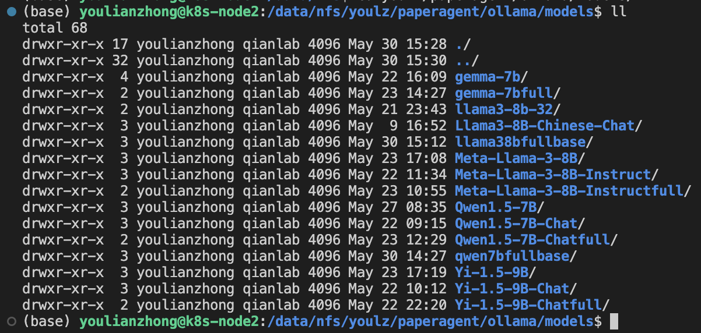

[toc]

# Ollama创建微调模型

## LLaMA-Factory 微调模型

### 配置微调数据集

```bash
git clone [https://github.com/hiyouga/LLaMA-Factory.git](https://github.com/hiyouga/LLaMA-Factory.git)
cd [LLaMA-Factory](https://github.com/hiyouga/LLaMA-Factory.git)
```

在 data/dataset_info.json 中添加并根据数据集进行设置，如我的微调数据放在了/data/nfs/youlz/finetuning_es_data.json，并为之取名为finetuning_es_data（之后要用到），我的微调数据集中有两个字段分别为 question 和 answer，我这里直接设置将 prompt 设置为了 question，将 response 设置为了 answer，这样微调出来的效果就是不用任何提示词，模型会将输入的内容统一都认为是 question 然后直接给出 answer。

```bash
  "finetuning_es_data": {
    "file_name": "/data/nfs/youlz/finetuning_es_data.json",
    "columns": {
      "prompt": "question",
      "query": "",
      "response": "answer",
      "history": ""
    }
  },
```

### 全量微调

shell 脚本参数设置如下：

```bash
#!/bin/bash

deepspeed --num_gpus 4 ../../src/train_bash.py \
    --deepspeed ../deepspeed/ds_z3_config.json \
    --stage sft \
    --do_train \
    --model_name_or_path /root/.cache/huggingface/Qwen1.5-7B \
    --dataset finetuning_data_name \
    --dataset_dir ../../data \
    --template qwen \
    --finetuning_type full \
    --output_dir ../../save/qwen/full/sft_qwen8 \
    --overwrite_cache \
    --overwrite_output_dir \
    --cutoff_len 1024 \
    --preprocessing_num_workers 16 \
    --per_device_train_batch_size 4 \
    --per_device_eval_batch_size 4 \
    --gradient_accumulation_steps 8 \
    --lr_scheduler_type cosine \
    --logging_steps 10 \
    --warmup_steps 10 \
    --save_steps 300 \
    --eval_steps 300 \
    --evaluation_strategy steps \
    --learning_rate 1e-5 \
    --num_train_epochs 2.0 \
    --max_samples 10000 \
    --val_size 0.1 \
    --ddp_timeout 180000000 \
    --plot_loss true\
    --fp16
```

其中 template 需要根据需要微调的模型进行变动

还可以添加自定义聊天模板到 [template.py](https://github.com/hiyouga/LLaMA-Factory/blob/main/src/llamafactory/data/template.py) 

以下是default、gemma、llama3、qwen 和 yi 的 template 实例

```python
# default
_register_template(
    name="default",
    format_user=StringFormatter(slots=["Human: {{content}}\nAssistant: "]),
    format_system=StringFormatter(slots=["{{content}}\n"]),
    format_separator=EmptyFormatter(slots=["\n"]),
)


# gemma
_register_template(
    name="gemma",
    format_user=StringFormatter(slots=["<start_of_turn>user\n{{content}}<end_of_turn>\n<start_of_turn>model\n"]),
    format_system=StringFormatter(slots=[{"bos_token"}, "{{content}}"]),
    format_observation=StringFormatter(
        slots=["<start_of_turn>tool\n{{content}}<end_of_turn>\n<start_of_turn>model\n"]
    ),
    format_separator=EmptyFormatter(slots=["<end_of_turn>\n"]),
    efficient_eos=True,
    force_system=True,
)

# llama3
_register_template(
    name="llama3",
    format_user=StringFormatter(
        slots=[
            (
                "<|start_header_id|>user<|end_header_id|>\n\n{{content}}<|eot_id|>"
                "<|start_header_id|>assistant<|end_header_id|>\n\n"
            )
        ]
    ),
    format_system=StringFormatter(
        slots=[{"bos_token"}, "<|start_header_id|>system<|end_header_id|>\n\n{{content}}<|eot_id|>"]
    ),
    format_observation=StringFormatter(
        slots=[
            (
                "<|start_header_id|>tool<|end_header_id|>\n\n{{content}}<|eot_id|>"
                "<|start_header_id|>assistant<|end_header_id|>\n\n"
            )
        ]
    ),
    default_system="You are a helpful assistant.",
    stop_words=["<|eot_id|>"],
    replace_eos=True,
)

# qwen
_register_template(
    name="qwen",
    format_user=StringFormatter(slots=["<|im_start|>user\n{{content}}<|im_end|>\n<|im_start|>assistant\n"]),
    format_system=StringFormatter(slots=["<|im_start|>system\n{{content}}<|im_end|>\n"]),
    format_observation=StringFormatter(slots=["<|im_start|>tool\n{{content}}<|im_end|>\n<|im_start|>assistant\n"]),
    format_separator=EmptyFormatter(slots=["\n"]),
    default_system="You are a helpful assistant.",
    stop_words=["<|im_end|>"],
    replace_eos=True,
)

# yi
_register_template(
    name="yi",
    format_user=StringFormatter(slots=["<|im_start|>user\n{{content}}<|im_end|>\n<|im_start|>assistant\n"]),
    format_system=StringFormatter(slots=["<|im_start|>system\n{{content}}<|im_end|>\n"]),
    format_separator=EmptyFormatter(slots=["\n"]),
    stop_words=["<|im_end|>"],
    replace_eos=True,
)
```

<aside>
 <strong>模型存放目录</strong>
</aside>

```bash
/data/nfs/youlz/paperagent/ollama/models
```



其中以 full 结尾的为全量微调后的模型

微调数据集使用的是 finetuning_data/unique_questions_3000.json

关于微调以后模型 size 大小不一致的问题我找到的有两种说法：

一是说原始模型是 32-bit，训练后保存的模型为 16-bit 【来自 llama-factory 微信交流群的解答】

二是说 Qwen1.5 原版 1200MB 的权重文件中，将 input embeddings 和 output embeddings 分开保存，但实质上它们的值完全相同，在保存时会只保留一份 embeddings，因此 Qwen1.5-0.5B 在 16-bit 精度实际上的大小是 900MB，32-bit 精度是 1800MB
在 full 微调时保存 32-bit 精度模型（1800MB），lora 微调时保存 16-bit 精度模型（900MB）【来自 [github issue](https://github.com/hiyouga/LLaMA-Factory/issues/3407#issuecomment-2079075764) 中的解答】


## Ollama 中创建微调模型

首先， clone the `ollama/ollama` repo：

```bash
git clone git@github.com:ollama/ollama.git ollama
cd ollama
```

然后获取其 llama.cpp 子模块：

```bash
git submodule init
git submodule update llm/llama.cpp
```

接下来，安装 Python 依赖：

```bash
python3 -m venv llm/llama.cpp/.venv
source llm/llama.cpp/.venv/bin/activate
pip install -r llm/llama.cpp/requirements.txt
```

（如果不需要对模型进行量化处理可以跳过）然后构建量化工具：quantize

```bash
make -C llm/llama.cpp quantize
```

**转换模型**

```bash
python llm/llama.cpp/convert.py ./model --outtype f16 --outfile converted.bin
```

将`./model`替换为微调后的模型文件的目录

在`llm/llama.cpp`目录下有两个用于模型转化的脚本，分别为`convert.py`和`convert-hf-to-gguf.py`，具体用哪个脚本进行转换我没有找到官方文档说明，建议一个不行就试另一个，在我使用过的模型中llama3 8b和 qwen 7b都是需要使用`convert-hf-to-gguf.py` 来转换的

<aside>
 <strong>转换模型后 bin 文件存放目录</strong>
</aside>

```bash
/data/nfs/youlz/paperagent/ollama/converted
```


**（可选）量化模型**

如果觉得转换后的模型文件太大了可以使用一下命令对模型进行量化处理，如果怕有精度损失也可以不用进行这一步

```bash
llm/llama.cpp/quantize converted.bin quantized.bin q4_0
```

converted.bin为上一步转换模型得到的文件，quantized.bin为量化后的文件，q4_0为量化选项表示使用 4bit 量化（官方推荐），当然还有很多的量化选项，具体参见[https://github.com/ollama/ollama/blob/main/docs/import.md#quantization-reference](https://github.com/ollama/ollama/blob/main/docs/import.md#quantization-reference)

<aside>
 <strong>量化模型后 bin 文件存放目录</strong>
</aside>

```bash
/data/nfs/youlz/paperagent/ollama/converted
```


**编写Modelfile**

那什么是 Modelfile

官方解释是：此文件是模型的蓝图，用于指定权重、参数、提示模板等。This file is the blueprint for your model, specifying weights, parameters, prompt templates and more.

官方给了一个简单的模板：

```bash
FROM quantized.bin
TEMPLATE "[INST] {{ .Prompt }} [/INST]"
```

但是官方这个通用模板太简单了，我建议在 ollama 的官网（[https://ollama.com/library](https://ollama.com/library)）上找到与微调模型相同系列的模型，然后使用 ollama 将模型下载到本地。使用 ollama show 命令可以查看模型的各种信息，具体可以使用  

```bash
ollama help show
```

查看相关命令的使用帮助

以 llama3 为例进行演示，使用

```bash
ollama show llama3:latest --modelfile
```

可以查看 llama3 8b 模型的官方 modelfile 是怎么写的，然后可以使用

```bash
ollama show llama3:latest --modelfile > finetunedllama3.modelfile
```

直接复制官方的 Modelfile 来创建自定义版本的 Modelfile 

**接下来modelfile 的重点就是更改 FROM 后面的路径**

一般将路径替换为已有`.gguf`的文件路径，

或者使用官方`convert.py`或`convert-hf-to-gguf.py` 转换后`.bin`的文件路径，

又或是使用`llm/llama.cpp/quantize`量化后`.bin`的文件路径

创建Ollama模型

最后，根据 Modelfile 创建一个模型：

```bash
ollama create example -f Modelfile
```

查看模型是否正常创建：

```bash
ollama list
```

运行模型：

```bash
ollama run modelname
```

<aside>
 正常创建模型后可能会出现报错
</aside>

BUG:

使用 ollama 运行一些导入的模型时可能会出现一下报错：
`Error: llama runner process has terminated: signal: aborted (core dumped)`

SOLVE：

退回convert*.py的版本

```bash
cd llama.cpp
git reset --hard 46e12c4692a37bdd31a0432fc5153d7d22bc7f72
```

[https://github.com/ollama/ollama/issues/4529#issuecomment-2121929243](https://github.com/ollama/ollama/issues/4529#issuecomment-2121929243)

然后退回到使用脚本转换模型那一步再来一遍

**使用一行命令直接导（不一定能成功）**

<aside>
 仅支持部分模型
</aside>

模型转换、量化和创建一步到位

```bash
ollama create --quantize q4_0 -f Modelfile my-llama3 
ollama run my-llama3
```

这里只需要将 Modelfile 中 FROM 后面的文件路径替换为模型文件的目录即可，my-llama3是自定义的在 ollama 中的模型名称

## Docker容器

我使用的 docker 容器存放在k8s-node4中，名为 oa（ollama 首尾字母缩写而成）

只要在k8s-node4节点上进入 oa 容器即可

```bash
docker exec -it oa bash
```

查看已下载和创建的 ollama 模型

```bash
ollama list
```


